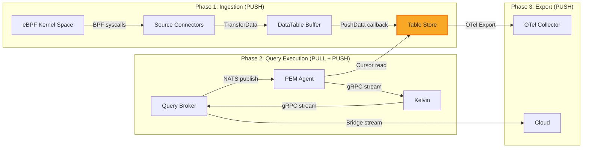
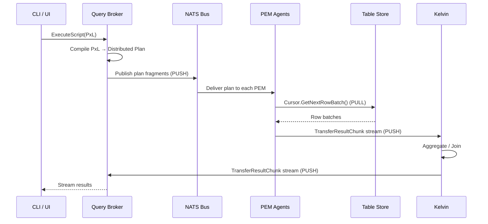
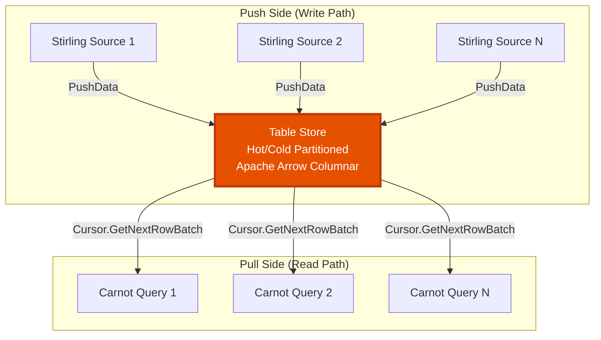
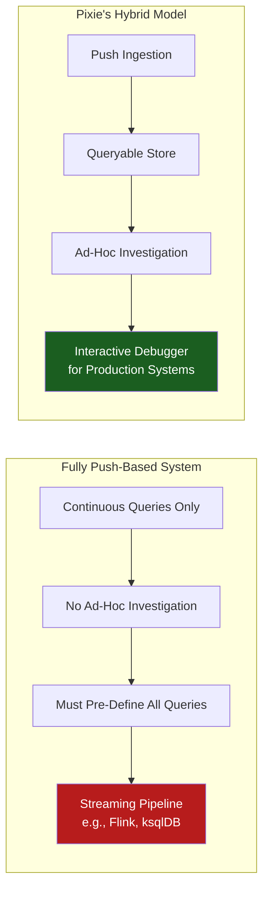
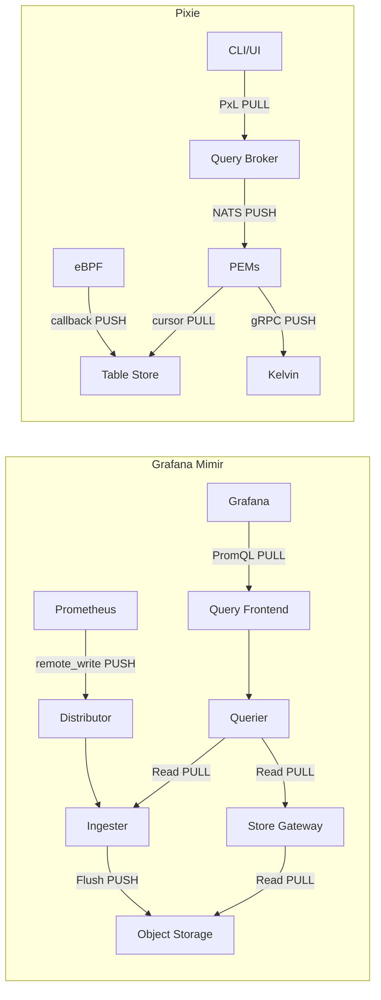
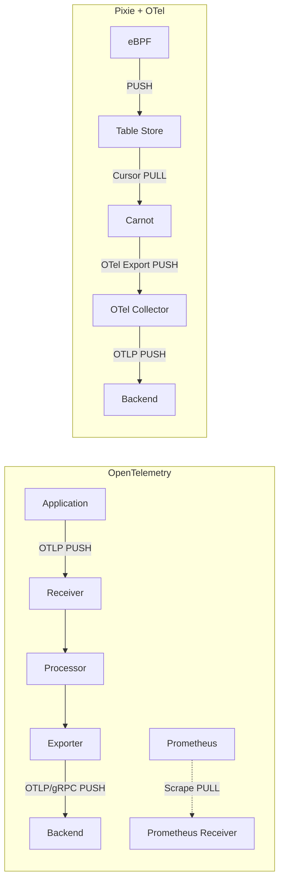
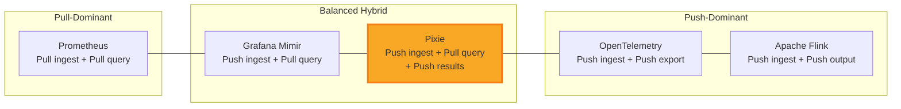

# Pixie Storage & Data Flow Architecture Analysis

**Document Type:** CTO-Level Technical Architecture Review
**System:** Pixie — CNCF Open-Source Kubernetes Observability Platform
**Focus:** Storage Model, Data Flow Directionality, Push vs Pull Architecture
**Date:** March 2026

---

## Table of Contents

1. [Executive Summary](#1-executive-summary)
2. [Current Data Flow Model Analysis](#2-current-data-flow-model-analysis)
3. [Push vs Pull Architecture Evaluation](#3-push-vs-pull-architecture-evaluation)
4. [Design Transformation Analysis](#4-design-transformation-analysis)
5. [Industry Comparison](#5-industry-comparison)
6. [Architectural Insight: Why Hybrid Models Dominate](#6-architectural-insight-why-hybrid-models-dominate)
7. [Final CTO Summary](#7-final-cto-summary)

---

## 1. Executive Summary

**Verdict: Pixie implements a hybrid push-pull architecture — and this is by design, not by accident.**

The apparent contradiction — "data appears to be pushed into storage, but querying via PxL behaves like a pull model" — is not a contradiction at all. It is the defining architectural signature of an **edge-native, in-cluster observability system** that must simultaneously solve two fundamentally different problems:

1. **Continuous high-throughput data ingestion** from kernel space (push-optimized)
2. **On-demand analytical queries** against ephemeral in-memory data (pull-optimized)

Pixie's architecture cleanly separates these concerns with the **Table Store** acting as the decoupling boundary. Data flows **into** the Table Store via push (Stirling → TableStore), and data flows **out** via pull (Carnot ← TableStore). Results then flow **back** to the requester via push (PEM → Kelvin → QueryBroker → Client).

This analysis traces every data path through the system with code-level evidence, evaluates the feasibility of converting to a fully push-based model, and compares Pixie's approach against Grafana, OpenTelemetry, and Prometheus.

---

## 2. Current Data Flow Model Analysis

### 2.1 The Three Data Flow Phases

Pixie's data lifecycle consists of three distinct phases, each with its own directionality:



### 2.2 Phase 1: Data Ingestion — Pure Push

**Direction: PUSH (producer-initiated, timer-driven)**

The ingestion pipeline is entirely push-based. Stirling actively pushes data from kernel space into the Table Store. At no point does the Table Store request or poll for data.

**Evidence chain:**

| Step | File | Lines | Mechanism | Direction |
|------|------|-------|-----------|-----------|
| Main loop | `src/stirling/stirling.cc` | 778–874 | `RunCore()` timer loop | Timer-driven |
| Sampling | `src/stirling/stirling.cc` | 831–838 | `source->TransferData(ctx)` | PULL from kernel |
| Buffering | `src/stirling/core/data_table.cc` | 62–131 | `ConsumeRecords()` | Internal drain |
| Push to store | `src/stirling/core/source_connector.cc` | 54–67 | `agent_callback(table_id, tablet_id, batch)` | PUSH |
| Store insertion | `src/table_store/table/table_store.cc` | 58–66 | `AppendData() → TransferRecordBatch()` | Receive |
| Callback binding | `src/vizier/services/agent/pem/pem_manager.cc` | 57–59 | `RegisterDataPushCallback(TableStore::AppendData)` | Registration |

**The `RunCore()` Loop — Two-Phase Timer:**

```
// src/stirling/stirling.cc:811-848
while (run_enable_) {
    // Phase 1: Sample data from kernel (every 200ms for socket tracer)
    if (source->sampling_freq_mgr().Expired(now)) {
        source->TransferData(ctx.get());  // Drains BPF maps → DataTable
    }

    // Phase 2: Push buffered data upstream (every 1000ms or threshold)
    if (source->push_freq_mgr().Expired(now) || DataExceedsThreshold(source->data_tables())) {
        source->PushData(data_push_callback_);  // DataTable → TableStore
    }
}
```

**Key insight:** The push is **dual-triggered** — both by timer expiration (`push_freq_mgr`, default 1s) and by data volume threshold (`DataExceedsThreshold`). This prevents both data staleness and buffer overflow.

**The Callback Chain:**

```
PEMManager::PostRegisterHookImpl()
  → stirling_->RegisterDataPushCallback(
        std::bind(&TableStore::AppendData, table_store(), _1, _2, _3))
  → Stirling stores as data_push_callback_
  → PushData() invokes callback with (table_id, tablet_id, record_batch)
  → TableStore::AppendData() inserts into hot partition
```

### 2.3 Phase 2: Query Execution — Pull-then-Push

**Direction: PUSH (plan dispatch) → PULL (data read) → PUSH (result streaming)**

Query execution is the most architecturally interesting phase because it reverses direction mid-flight:



**Step-by-step with code evidence:**

#### Step 1: Plan Dispatch (PUSH)
```go
// src/vizier/services/query_broker/controllers/launch_query.go:61
natsConn.Publish(agentTopic, msgAsBytes)  // One-way NATS publish to each agent
```
The Query Broker pushes plan fragments to agents. Agents do not poll for work.

#### Step 2: Table Store Read (PULL)
```cpp
// src/carnot/exec/memory_source_node.cc:55-88 (OpenImpl)
cursor_ = std::make_unique<Table::Cursor>(table);  // Create iterator

// src/carnot/exec/memory_source_node.cc:111 (GetNextRowBatch)
auto row_batch = cursor_->GetNextRowBatch();  // Active pull from table
```
The Carnot execution engine actively pulls data from the Table Store via `Table::Cursor`. The Table Store is passive — it never pushes query results.

#### Step 3: Result Streaming (PUSH)
```cpp
// src/carnot/exec/grpc_sink_node.cc:131 (StartConnection)
writer_ = stub_->TransferResultChunk(context_.get(), &response_);

// src/carnot/exec/grpc_sink_node.cc:158 (TryWriteRequest)
writer_->Write(req);  // Client-streaming: PEM pushes to Kelvin
```
PEMs initiate gRPC client-streaming connections and actively push result chunks. The `TransferResultChunk` RPC uses client-streaming (`stream TransferResultChunkRequest`), meaning the PEM controls the data flow rate.

#### Step 4: Kelvin Aggregation (Internal Pull from Queue)
```cpp
// src/carnot/exec/grpc_router.cc:65
snt->source_node->EnqueueRowBatch(std::move(req));  // Router enqueues

// src/carnot/exec/grpc_source_node.cc:69
row_batch_queue_.try_dequeue(row_batch);  // Source node pulls from queue
```
Inside Kelvin, `GRPCRouter` receives pushed results and enqueues them. `GRPCSourceNode` pulls from a `BlockingConcurrentQueue` — an internal push-to-pull boundary.

#### Step 5: Result Forwarding (PUSH → Channel → PULL)
```go
// src/vizier/services/query_broker/controllers/query_result_forwarder.go:592
activeQuery.queryResultCh <- msg  // Kelvin pushes to buffered channel (size 1024)

// src/vizier/services/query_broker/controllers/query_result_forwarder.go:549
case msg := <-activeQuery.queryResultCh:  // Consumer pulls from channel
```

### 2.4 Phase 3: External Export — Push-Dominated

**Direction: Predominantly PUSH**

| Interface | Direction | Evidence |
|-----------|-----------|----------|
| **OTel Export** | PUSH | `otel_export_sink_node.cc:303,433,496` — calls `Export()` gRPC on OTel collector |
| **Cron Scripts** | PUSH | `script_runner.go:270` — executes queries on timer, pushes results to OTel |
| **Vizier→Cloud Bridge** | BIDIRECTIONAL STREAM | `bridge/server.go:723` — persistent gRPC stream, Vizier-initiated |
| **Cloud API (Passthrough)** | REQUEST-RESPONSE | `ptproxy/vizier_pt_proxy.go:166-170` — NATS-based async request/reply |
| **Prometheus /metrics** | PULL | `vzmetrics/scrape.go:149` — HTTP GET to pod `/metrics` endpoints |
| **Metrics Forwarding** | PUSH | `vzmetrics/` — scrape locally, push via NATS to cloud → BigQuery |

### 2.5 The Table Store: The Architectural Fulcrum

The Table Store is the **decoupling point** between push and pull. It is the only stateful component that bridges the ingestion and query paths:



**Structural properties:**
- **Hot partition:** Recent writes, protected by spinlock, receives `TransferRecordBatch()` pushes
- **Cold partition:** Compacted Apache Arrow batches (every 1 minute), read-optimized for cursors
- **FIFO eviction:** Memory-bounded (default 1280 MB total, 64 MB per table), oldest data evicted first
- **Concurrent access:** Writers (Stirling push) and readers (Carnot cursors) operate on different partitions, minimizing contention

---

## 3. Push vs Pull Architecture Evaluation

### 3.1 Component-Level Classification

```mermaid
graph TB
    subgraph "PUSH Components"
        direction TB
        P1["Stirling → Table Store<br/>(timer + threshold callback)"]
        P2["PEM → Kelvin<br/>(gRPC client-streaming)"]
        P3["Kelvin → Query Broker<br/>(gRPC client-streaming)"]
        P4["OTel Export<br/>(gRPC Export() calls)"]
        P5["Metrics Forwarding<br/>(NATS publish)"]
        P6["Plan Dispatch<br/>(NATS publish)"]
    end

    subgraph "PULL Components"
        direction TB
        L1["eBPF Map Drain<br/>(BPF syscall reads)"]
        L2["Table Store Read<br/>(Cursor iteration)"]
        L3["Kelvin GRPCSourceNode<br/>(queue dequeue)"]
        L4["Prometheus /metrics<br/>(HTTP GET scrape)"]
    end

    subgraph "BIDIRECTIONAL"
        direction TB
        B1["Vizier ↔ Cloud Bridge<br/>(persistent gRPC stream)"]
        B2["Cloud API Passthrough<br/>(NATS request/reply)"]
    end

    style P1 fill:#1b5e20,color:#fff
    style P2 fill:#1b5e20,color:#fff
    style P3 fill:#1b5e20,color:#fff
    style P4 fill:#1b5e20,color:#fff
    style P5 fill:#1b5e20,color:#fff
    style P6 fill:#1b5e20,color:#fff
    style L1 fill:#b71c1c,color:#fff
    style L2 fill:#b71c1c,color:#fff
    style L3 fill:#b71c1c,color:#fff
    style L4 fill:#b71c1c,color:#fff
    style B1 fill:#e65100,color:#fff
    style B2 fill:#e65100,color:#fff
```



### 3.2 Quantitative Assessment

| Metric | Push | Pull | Bidirectional |
|--------|------|------|---------------|
| **Component count** | 6 | 4 | 2 |
| **Data volume** | ~95% of all bytes | ~5% (query results are filtered subsets) | Control plane only |
| **Latency sensitivity** | High (kernel buffers overflow) | Medium (query timeout 180s) | Low (async bridge) |
| **Failure impact** | Data loss (BPF buffers finite) | Query failure (retryable) | Degraded cloud features |

**Conclusion:** Pixie is **push-dominant by data volume** but **pull-dependent for its core value proposition** (interactive queries). The system is best classified as a **push-ingest, pull-query hybrid**.

### 3.3 Direction Analysis at Each Boundary

```
┌─────────────────────────────────────────────────────────────────────┐
│                    DATA FLOW DIRECTION MAP                         │
│                                                                     │
│  Kernel ──PULL──▶ Stirling ──PUSH──▶ Table Store ◀──PULL── Carnot  │
│                                                                     │
│  Query Broker ──PUSH──▶ Agents (plan dispatch via NATS)            │
│  PEM Agents ──PUSH──▶ Kelvin (results via gRPC streaming)         │
│  Kelvin ──PUSH──▶ Query Broker (results via gRPC streaming)       │
│  Query Broker ──PUSH──▶ Client (results via streaming)            │
│                                                                     │
│  Carnot ──PUSH──▶ OTel Collector (export via gRPC)                │
│  Vizier ◀──BIDIR──▶ Cloud (persistent gRPC stream)                │
│  Vizier Pods ◀──PULL── Metrics Scraper ──PUSH──▶ Cloud            │
│                                                                     │
│  Legend: ──PUSH──▶ = producer-initiated                            │
│          ◀──PULL── = consumer-initiated                            │
│          ◀──BIDIR──▶ = persistent bidirectional stream             │
└─────────────────────────────────────────────────────────────────────┘
```

---

## 4. Design Transformation Analysis

### 4.1 Can Pixie Be Converted to Fully Push-Based?

**Short answer: Technically possible, architecturally inadvisable.**

Converting the pull components to push would require eliminating the on-demand query model entirely. Let's evaluate each pull component:

#### Pull Component 1: eBPF Map Drain
```
Current: BPF syscall reads (pull from kernel maps)
Push alternative: BPF ring buffer with callback notification
```
**Feasibility: PARTIAL.** Modern BPF ring buffers (`BPF_MAP_TYPE_RINGBUF`, kernel 5.8+) support event-driven notification, which is closer to push. However, perf buffers still require polling, and Pixie supports older kernels. The `TransferData()` call in `stirling.cc:831` would need to be replaced with an event-driven model. **Effort: High. Benefit: Marginal** — the 200ms polling interval already provides near-real-time data.

#### Pull Component 2: Table Store Cursor Read (THE CRITICAL ONE)
```
Current: Carnot pulls via Table::Cursor when query executes
Push alternative: Table Store pushes to subscribers on write
```
**Feasibility: POSSIBLE but fundamentally changes the system's identity.**

A push-based Table Store would mean:
- Every write triggers evaluation against active subscriptions (continuous queries)
- The Table Store becomes a **streaming engine** rather than a **queryable store**
- Memory model changes from "retain recent data for ad-hoc queries" to "route data to registered consumers"
- Loses the ability to query historical data (even the short 24-hour window)
- Essentially transforms Pixie from an **interactive debugger** into a **streaming pipeline**

This is the transformation from Pixie into something resembling Apache Flink or ksqlDB — a fundamentally different product.

#### Pull Component 3: Kelvin GRPCSourceNode Queue
```
Current: Dequeue from BlockingConcurrentQueue
Push alternative: Direct callback invocation
```
**Feasibility: EASY but unnecessary.** The queue exists as a backpressure mechanism between the network receiver and the execution engine. Replacing it with direct push would risk overwhelming the execution pipeline. The queue is an intentional design choice, not a limitation.

#### Pull Component 4: Prometheus /metrics Scrape
```
Current: HTTP GET to pod /metrics endpoints
Push alternative: Pushgateway or OTLP push
```
**Feasibility: TRIVIAL.** Already partially implemented — metrics are scraped locally then pushed to cloud via NATS. The local scrape could be replaced with push, but Prometheus scrape is an industry standard and changing it gains nothing.

### 4.2 Transformation Impact Matrix

| Component | Conversion Effort | Risk | Benefit | Recommendation |
|-----------|------------------|------|---------|----------------|
| eBPF Map Drain | High | Medium | Low | **Keep pull** — polling is reliable and kernel-compatible |
| Table Store Cursor | Very High | Critical | Negative | **Keep pull** — this IS Pixie's differentiator |
| Kelvin Queue | Low | Medium | None | **Keep pull** — backpressure is essential |
| Prometheus Scrape | Trivial | Low | None | **Keep pull** — industry standard |

### 4.3 The Fundamental Tradeoff



**Converting Pixie to fully push-based would eliminate its core value proposition:** the ability to ask arbitrary questions about recent system behavior without pre-defining what to collect or where to send it.

---

## 5. Industry Comparison

### 5.1 Grafana Stack (Mimir + Loki + Tempo)

**Architecture: Push-Ingest, Pull-Query (same hybrid as Pixie)**



| Aspect | Grafana Mimir | Pixie | Analysis |
|--------|---------------|-------|----------|
| **Ingestion** | PUSH (Prometheus remote_write) | PUSH (Stirling callback) | Same pattern |
| **Storage** | Distributed (Ingester + S3) | In-memory only (Table Store) | Pixie trades durability for latency |
| **Query** | PULL (PromQL via Query Frontend) | PULL (PxL via Query Broker) | Same pattern |
| **Result delivery** | HTTP response (pull) | gRPC streaming (push) | Pixie more efficient for large results |
| **Retention** | Months–years | Hours (memory-bounded) | Fundamentally different use cases |
| **Mimir 3.0 innovation** | Kafka buffer between ingest/query | Table Store hot/cold partitions | Both decouple write and read paths |

**Key difference:** Grafana separates ingestion and query scaling via Kafka (Mimir 3.0). Pixie co-locates ingestion and query execution on the same node (PEM), which eliminates network transfer for local queries but creates resource contention.

### 5.2 OpenTelemetry

**Architecture: Push-Dominant Pipeline**



| Aspect | OpenTelemetry Collector | Pixie | Analysis |
|--------|------------------------|-------|----------|
| **Data model** | Push pipeline (Receiver → Processor → Exporter) | Push-store-pull-push | OTel is simpler; Pixie adds queryable storage |
| **Instrumentation** | SDK-based (requires code changes) | eBPF (zero instrumentation) | Pixie's key differentiator |
| **Processing** | In-flight (sampling, batching, enrichment) | Post-storage (full SQL-like queries) | Different tradeoff: OTel filters early, Pixie retains all |
| **Storage** | None (pass-through) | In-memory Table Store | OTel delegates storage to backends |
| **Query** | None (backends provide query) | Built-in PxL engine | Pixie is self-contained |
| **Pull support** | Prometheus Receiver (scrape) | Prometheus /metrics + cursor reads | Both support pull where needed |

**Key insight:** OpenTelemetry is a **telemetry pipeline** — it moves data from sources to sinks. Pixie is a **telemetry platform** — it collects, stores, queries, and visualizes data. OTel's push-dominant model works because it doesn't need to query data; Pixie's hybrid model exists because it does.

### 5.3 Prometheus

**Architecture: Pull-Ingest, Pull-Query**

| Aspect | Prometheus | Pixie | Analysis |
|--------|-----------|-------|----------|
| **Ingestion** | PULL (scrape targets) | PUSH (Stirling callback) | Opposite approaches |
| **Storage** | On-disk TSDB | In-memory Arrow tables | Different durability models |
| **Query** | PULL (PromQL HTTP API) | PULL (PxL distributed execution) | Same pull pattern |
| **Short-lived processes** | Requires Pushgateway (workaround) | eBPF captures regardless | Pixie naturally handles ephemeral workloads |
| **Federation** | Pull from downstream Prometheus | Push from PEMs to Kelvin | Different aggregation models |

### 5.4 Comparison Matrix

```
┌──────────────────┬──────────────┬─────────────┬──────────────┬─────────────┐
│                  │  Prometheus  │   Grafana   │  OpenTelemetry│   Pixie     │
│                  │              │   Mimir     │  Collector   │             │
├──────────────────┼──────────────┼─────────────┼──────────────┼─────────────┤
│ Ingestion        │ PULL (scrape)│ PUSH (rw)   │ PUSH (OTLP)  │ PUSH (eBPF) │
│ Intermediate     │ N/A          │ Kafka buffer│ Processor    │ Table Store │
│ Storage          │ On-disk TSDB │ S3 + Cache  │ None         │ In-memory   │
│ Query            │ PULL (HTTP)  │ PULL (HTTP) │ N/A          │ PULL (PxL)  │
│ Result Delivery  │ PULL (HTTP)  │ PULL (HTTP) │ PUSH (export)│ PUSH (gRPC) │
│ Export           │ Remote Write │ N/A (is BE) │ PUSH (OTLP)  │ PUSH (OTel) │
│ Overall Model    │ Pull-Pull    │ Push-Pull   │ Push-Push    │ Push-Pull   │
├──────────────────┼──────────────┼─────────────┼──────────────┼─────────────┤
│ Retention        │ Weeks        │ Months      │ None         │ Hours       │
│ Instrumentation  │ Client libs  │ Prometheus  │ SDK          │ None (eBPF) │
│ Ad-hoc Query     │ ✓            │ ✓           │ ✗            │ ✓           │
│ Zero-config      │ ✗            │ ✗           │ ✗            │ ✓           │
└──────────────────┴──────────────┴─────────────┴──────────────┴─────────────┘
```

---

## 6. Architectural Insight: Why Hybrid Models Dominate

### 6.1 The Fundamental Tension

Every observability system faces the same tension:

> **Data producers generate continuously; data consumers query sporadically.**

This mismatch means:
- **Ingestion** benefits from push: producers control rate, no polling overhead, natural backpressure via buffering
- **Querying** benefits from pull: consumers ask only when needed, no wasted computation on unread results, ad-hoc flexibility

No single direction optimally serves both sides. This is why **every production observability system converges on a hybrid model**, even if they start with a philosophical preference for one direction.

### 6.2 The Spectrum of Hybrid Approaches



Even systems with strong directional preferences introduce the opposite pattern at boundaries:
- **Prometheus** (pull-dominant) added `remote_write` (push) for federation and long-term storage
- **OpenTelemetry** (push-dominant) added the Prometheus Receiver (pull/scrape) for backwards compatibility
- **Kafka** (push-dominant) supports pull consumers via consumer groups
- **Grafana Mimir** (push-ingest) uses pull for all queries

### 6.3 Why Pixie's Specific Hybrid Works

Pixie's hybrid is particularly well-suited to its domain for three reasons:

**1. eBPF data cannot be pulled on-demand**

eBPF perf buffers and ring buffers are kernel-managed, fixed-size, and will overwrite data if not consumed promptly. A pull-based ingestion model (like Prometheus scrape) would require the kernel to hold data until the consumer asks for it — which the kernel simply won't do. Push is the only viable option for kernel-to-userspace data transfer.

**2. In-memory storage enables sub-second query latency**

Because data lives in the Table Store (Arrow columnar format, already in process memory), pull-based queries avoid all network I/O for the data read step. A PEM reading from its local Table Store has microsecond-level access latency. This makes interactive, ad-hoc debugging viable — something impossible with a push-only streaming model where you'd need to pre-register every query.

**3. Distributed query results require push for efficiency**

When a PxL query touches 100 PEMs, each PEM must send its partial results to Kelvin for aggregation. Pull-based result collection (Kelvin polling each PEM) would add O(N) round-trip latency and require Kelvin to maintain state about which PEMs to poll. Push-based streaming (each PEM pushes to Kelvin) is both simpler and faster — results start arriving as soon as any PEM finishes, with no coordination overhead.

### 6.4 The Anti-Patterns: When Purity Fails

**Pure Push fails for observability because:**
- You cannot anticipate every question an operator will ask during an incident
- Pre-registered continuous queries consume compute proportional to query count × data rate
- Without queryable storage, debugging becomes "hope you set up the right alert"

**Pure Pull fails for observability because:**
- Polling introduces latency floors (minimum = poll interval)
- High-frequency data requires high-frequency polling (expensive)
- Short-lived processes may terminate between polls (data loss)
- Kernel-level data sources (eBPF) don't support consumer-initiated reads

---

## 7. Final CTO Summary

### 7.1 Resolving the "Contradiction"

> "Data appears to be pushed into storage, but querying via PxL behaves like a pull model."

**This is not a contradiction — it is a deliberate architectural separation of concerns.**

The Table Store is a **write-optimized, read-compatible** data structure that serves as the boundary between two fundamentally different data flow patterns:

| Concern | Pattern | Why |
|---------|---------|-----|
| **Ingestion** (kernel → store) | Push | eBPF buffers are transient; push ensures no data loss |
| **Query** (store → engine) | Pull | Ad-hoc queries are inherently on-demand; pull avoids wasted computation |
| **Result delivery** (engine → client) | Push | Streaming results from distributed agents is more efficient than polling |

The Table Store acts as a **temporal buffer** that decouples the continuous push of kernel telemetry from the sporadic pull of human-initiated queries. This is the same pattern used by Kafka (push from producers, pull by consumers), database WALs (push writes, pull reads), and CPU caches (push from memory controller, pull by execution units).

### 7.2 Architecture Classification

**Pixie is a push-ingest, pull-query, push-result hybrid system.**

More precisely:
- **Data plane (ingestion):** Push-only, timer-driven, callback-based
- **Control plane (query dispatch):** Push-only, NATS pub/sub
- **Query execution (data read):** Pull-only, cursor-based
- **Query execution (result delivery):** Push-only, gRPC client-streaming
- **External export (OTel, metrics):** Push-only
- **Cloud bridge:** Bidirectional persistent stream

### 7.3 Strategic Assessment

| Question | Assessment |
|----------|------------|
| **Should Pixie move to fully push-based?** | **No.** It would eliminate ad-hoc query capability, Pixie's core differentiator. |
| **Should Pixie move to fully pull-based?** | **No.** Impossible for eBPF ingestion; inefficient for distributed result collection. |
| **Is the hybrid model a compromise?** | **No.** It is the optimal design for an edge-native, in-memory observability platform. |
| **Does this model scale?** | **Within its design envelope** (single-cluster, hours of retention). For longer retention or cross-cluster queries, data must be exported (pushed) to external systems. |
| **How does this compare to industry?** | **Aligned.** Grafana Mimir, Datadog Agent, and New Relic Infrastructure all use push-ingest, pull-query hybrids. Pixie's unique contribution is eBPF-based zero-instrumentation push ingestion combined with in-cluster query execution. |

### 7.4 Recommendations

1. **Preserve the hybrid model** — it is architecturally sound and well-matched to the problem domain
2. **Invest in the push→pull boundary** (Table Store) — this is where ingestion throughput meets query latency; optimizations here (better compaction, adaptive eviction, column pruning) yield system-wide benefits
3. **Expand push-based export** — the OTel export sink is the right pattern for getting data out of Pixie's ephemeral store into durable backends; consider adding native Prometheus remote_write export
4. **Consider adding continuous query support** — a push-based "standing query" mode (where pre-registered PxL scripts trigger on new data) would complement the pull-based ad-hoc model without replacing it, similar to how Kafka Streams supplements Kafka's pull consumer model

---

*Analysis based on Pixie source code at commit `ce714e6e8`. All file paths and line numbers reference the analyzed codebase revision.*
